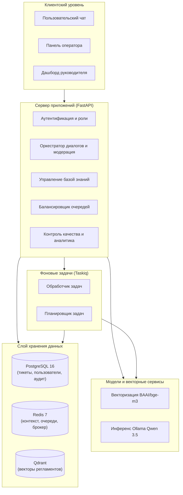

# Сервис «ИИ-помощник поставщика»

Интеллектуальная система автоматизации службы поддержки пользователей АИС «Портал поставщиков» на основе гибридного поиска по базе знаний (RAG), предварительной модерации обращений, балансировки очереди операторов и модуля контроля качества обслуживания.

---

## Технологический стек

**Серверная часть и API:**  


**Искусственный интеллект и RAG:**  


**Базы данных и очереди:**  


**Клиентская часть:**  


**Инфраструктура и инструменты качества:**  


---

## Описание системы

Система разработана для комплексной автоматизации службы клиентской и технической поддержки АИС «Портал поставщиков» г. Москвы. Платформа помогает участникам закупок оперативно получать разъяснения по регламентам 44-ФЗ и 223-ФЗ, автоматизирует первую линию обращений, снижает нагрузку на операторов и предоставляет руководству объективный инструмент мониторинга качества сервиса.

Комплекс разделен на логические функциональные блоки:

### 1. Клиентский интерфейс диалогов

Пользовательская часть построена по многосессионной модели: в боковой панели отображается список независимых сессий, история предыдущих консультаций и возможность параллельно вести несколько обращений по разным закупкам. Каждое обращение представляет собой изолированную бизнес-сессию со своим состоянием, контекстом диалога в Redis и отдельным жизненным циклом тикета в PostgreSQL.

### 2. Модерация и фильтрация речи

Сквозной синхронный фильтр проверяет сообщения пользователей и операторов в реальном времени:
- При выявлении ненормативной лексики со стороны клиента сессия немедленно прерывается с фиксацией в журнале аудита, что снимает с операторов необходимость отрабатывать деструктивные диалоги и не ухудшает их статистику.
- Исходящие ответы операторов валидируются перед отправкой клиенту, предотвращая репутационные риски.

### 3. Поисково-генеративный контур (RAG)

Архитектура RAG построена вокруг многоступенчатого конвейера, оптимизированного для работы с нормативной базой (регламенты госзакупок, инструкции Портала поставщиков, 44-ФЗ и 223-ФЗ) и исключения фактических ошибок (галлюцинаций):

- **Иерархическая индексация и поиск (Small-to-Big Retrieval)**: нормативные документы PDF и DOCX предварительно разбираются в абстрактное синтаксическое дерево (AST) с сохранением структуры глав, пунктов и таблиц, линеаризованных в Markdown. Вместо поиска по крупным фрагментам тексты нарезаются на компактные чанки, которые векторизуются моделью BAAI/bge-m3 (1024D) и индексируются в коллекции Qdrant. При поиске находятся наиболее релевантные дочерние чанки, а затем система подтягивает из реляционной базы полные родительские узлы (до 6000 символов Markdown). Это исключает фрагментарность: языковая модель получает в промпт законченный раздел с окружающими таблицами и примечаниями.
- **Двухэтапный анализ и маршрутизация запроса**:
  1. *Детерминированный пре-пасс*: первичная обработка регулярными выражениями без задержек инференса. Извлекает коды системных ошибок (в формате `0x...`), номера статей законов (например, статья 93 или 34), правовой режим (44-ФЗ или 223-ФЗ), маркеры финансовых споров и критических дедлайнов для автоматического присвоения обращению уровня приоритета.
  2. *Контекстуализация запроса*: модель на основе истории диалога из Redis преобразует краткую или неполную реплику пользователя в самостоятельный поисковый запрос (standalone query), восстанавливая опущенные сущности.
- **Адаптивная фильтрация и спектральный разрыв (Spectral Gap)**: порог отсечения релевантности динамически рассчитывается в зависимости от длины запроса. Если максимальный скор ниже порога и отсутствует выраженный спектральный разрыв между первым и вторым кандидатами, система переходит в режим деградации (degraded mode) и сообщает пользователю об отсутствии надежных данных в регламенте, не обращаясь к генератору.
- **Гибридное переранжирование (Lexical-Dense Reranking)**: кандидаты ранжируются по комбинированной метрике плотной векторной близости и лексического покрытия терминов запроса. Реализован предметный бустинг: точное совпадение шестнадцатеричных кодов ошибок и номеров статей законов увеличивает вес кандидата, а при совпадении статьи в названии раздела нормативный акт жестко фиксируется на первом месте в выдаче.
- **Потоковая генерация и инлайн-верификация фактов**: инференс языковой модели Qwen 3.5 выполняется через локальный сервер Ollama в потоковом режиме (SSE). Буферизатор предложений на базе токенизатора Razdel группирует поток токенов в синтаксически завершенные предложения и элементы списков Markdown. Каждое сгенерированное предложение на лету проходит фактологический контроль: любые числовые значения (сроки, дни, суммы, проценты) обязаны сопровождаться сноской на первоисточник и строго присутствовать в найденных нормативных текстах. При обнаружении нерелевантных цифр утверждение блокируется, обеспечивая юридическую выверенность ответа.

### 4. Маршрутизация и линии поддержки

Если вопрос требует участия человека или пользователь запрашивает сотрудника, классификатор определяет тематику и направляет обращение на профильную линию:
- **Первая линия (L1)**: базовые регламенты закупок, навигация по порталу, порядок участия в котировочных сессиях и типовые вопросы.
- **Вторая линия (L2)**: технические сложности на стороне пользователя — настройка электронной подписи (ЭЦП), КриптоПро, сертификатов, проблемы с браузерами и интеграциями.
- **Третья линия (L3)**: внутренняя группа системных инженеров и программистов платформы, устраняющих программные ошибки и серверные сбои. Пользователи портала напрямую с третьей линией не взаимодействуют — передача задач выполняется дежурными операторами или автоматически.

Оператор может при необходимости вручную перенаправить обращение на другую линию с указанием причины перевода.

### 5. Панель оператора и встроенный AI Copilot

Для дежурных специалистов реализовано рабочее пространство с управлением рабочими состояниями:
- **Балансировка очередей**: реактивное распределение обращений из очереди Redis по свободным слотам операторов в статусе «На линии» с ограничением числа одновременных диалогов.
- **Контроль смены и отказоустойчивость**: статусы «На линии», «Перерыв», «Не в сети»; закрепление сессий за оператором на 10 минут при кратковременном разрыве соединения; автоматическое закрытие неактивных диалогов по таймауту.
- **Аналитический ассистент AI Copilot**: прямо в окне диалога оператору отображается выжимка сути проблемы в 1–2 предложениях, готовый черновик ответа по регламенту и результаты векторного поиска похожих решенных тикетов из архива Qdrant.

### 6. Контроль качества (AI-QA) и аналитика

После завершения каждого обращения запускается фоновый аудит:
- **Автоматический аудит диалогов**: языковая модель оценивает 100% закрытых сессий на полноту решения вопроса, понятность изложения и соблюдение стандартов вежливости.
- **Анализ первопричин негативных оценок**: разделение инфраструктурных сбоев портала и внешних сервисов от ошибок операторов. В случае технической аварии оценка исключается из персонального рейтинга сотрудника и направляется в реестр багов для разработчиков.
- **Дашборд руководителя**: сводная панель отображает динамику соблюдения нормативов времени ответа (SLA), скорректированную удовлетворенность (CSAT), распределение нагрузки по линиям и активность сотрудников.

### 7. База знаний и цикл самообучения (Data Flywheel)

Модуль базы знаний обеспечивает постоянное обновление справочной информации:
- **Структурный парсер документов**: конвейер предварительной обработки регламентов на базе Docling и PyMuPDF с извлечением заголовков, текстовых блоков и таблиц в формате Markdown.
- **Самообучение базы знаний**: успешные нестандартные решения операторов преобразуются в черновики статей базы знаний в формате Markdown. После верификации руководителем материал автоматически нарезается на фрагменты, векторизуется и пополняет поисковый индекс Qdrant.

---

## Архитектура



---

## Структура проекта

```text
.
├── backend/
│   ├── alembic/                 # Миграции структуры реляционной базы данных
│   ├── notebooks/               # Эксперименты с парсингом документов
│   ├── src/
│   │   ├── analytics/           # Аудит диалогов, метрики SLA и CSAT
│   │   ├── api/                 # Маршрутизаторы FastAPI v1
│   │   ├── auth/                # Пользователи, роли и авторизация
│   │   ├── chat/                # Сессии диалогов, модерация, SSE-потоки
│   │   ├── core/                # Конфигурация, брокер фоновых задач Taskiq
│   │   ├── db/                  # Сессии SQLAlchemy, DDL-модели, сиды данных
│   │   ├── kb/                  # Парсинг регламентов, чанкинг, индексация
│   │   ├── operators/           # Управление сменами и распределение тикетов
│   │   ├── rag/                 # Поиск, переранжирование, генерация ответа
│   │   └── main.py              # Точка входа веб-приложения FastAPI
│   ├── tests/                   # Автоматические тесты (pytest)
│   ├── Dockerfile
│   └── pyproject.toml
├── frontend/
│   ├── src/
│   │   ├── components/          # Компоненты чата, панели оператора и дашборда
│   │   ├── services/            # Клиентские сервисы API и SSE
│   │   └── App.tsx
│   ├── Dockerfile
│   └── package.json
├── docs/                        # Архитектурная документация и спецификации
├── notes/                       # Исходные регламенты закупок
├── docker-compose.yml           # Конфигурация запуска сервисов в Docker
└── README.md
```

---

## Установка и запуск

Запуск всех компонентов платформы (сервер приложений, клиентская часть, базы данных, очереди и фоновые обработчики) выполняется через Docker Compose.

1. Подготовка конфигурации окружения (создание файла `.env` на основе шаблона и настройка параметров подключения к базам данных, Qdrant и Ollama):

```bash
cp backend/.env.example backend/.env
```

2. Сборка и запуск контейнеров:

```bash
docker compose up -d --build
```

Точки входа сервисов:
- Пользовательский веб-интерфейс: `http://localhost:5173`
- Интерактивная документация API (Swagger UI): `http://localhost:8000/docs`
- Веб-панель базы данных Qdrant: `http://localhost:6333/dashboard`

---

## Проверка качества и тестирование

Запуск проверок линтера и набора автоматических тестов:

```bash
docker compose exec api ruff check .
docker compose exec api pytest
```
